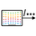

# [](./lidar2ros_appicon.psd) lidar2ros for iPad

Publish iPad Pro LiDAR data & more in ROS 2.

This repository only contains the source code.
To run it, set up an Xcode project and import the source code.

<!-- TODO link to app on the App Store once it's published -->

<!-- TODO add screenshot/demo -->

## Using the app

Display a simple help page in the app by pressing the help button in the lower right corner.

<!-- TODO add more info, link to ros2-web-bridge -->

<!-- TODO add table with all the types of data that the app can publish -->

## Modifying the app icon

The source file for the app icon is [`lidar2ros_appicon.psd`](./lidar2ros_appicon.psd).
Modify it using your favourite PSD-compatible editor (e.g. [Photopea](https://www.photopea.com)). Then, create the necessary PNGs, since Xcode requires various sizes for the app icon.

Make sure [`brew` is installed](https://brew.sh), then install `imagemagick`:

```zsh
% brew install imagemagick
```

To simply export the PSD file to a PNG (if you want a preview):

```zsh
% convert 'lidar2ros_appicon.psd[0]' -resize 200x200 appicon.png
```

Run the provided script to generate all the required PNGs:

```zsh
% ./gen_appicon_assets.sh
```

This script also generates the rounded app icon used at the top of this README.
