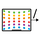

# [](./app-icon/lidar2ros_appicon.psd) &nbsp; lidar2ros for iPad

Publish iPad Pro LiDAR data & more in ROS 2.

Note: this repository only contains the source code & assets.
To run the app, set up an Xcode project and import this.

<!-- TODO link to app on the App Store once it's published -->

<!-- TODO add screenshot/demo -->

## Using the app

Display a simple help page in the app by pressing the help button in the lower right corner.

### Setting up a remote rosbridge

For the data to be published in ROS 2, start a [ros2-web-bridge](https://github.com/RobotWebTools/ros2-web-bridge) on a computer on the same network as your iPad (or any network reachable from your iPad).

0. Make sure [ROS 2 is installed](https://index.ros.org/doc/ros2/Installation/) and sourced
1. [Install ros2-web-bridge](https://github.com/RobotWebTools/ros2-web-bridge#install)
    ```sh
    $ git clone https://github.com/RobotWebTools/ros2-web-bridge.git
    $ cd ros2-web-bridge
    $ npm install
    ```
1. [Run ros2-web-bridge](https://github.com/RobotWebTools/ros2-web-bridge#run-examples)
    ```sh
    $ node bin/rosbridge.js
    ```

### Connecting to the remote rosbridge

To connect to the remote rosbridge, in the app, enter the computer's IP and port (e.g. `x.y.z.a:bcde`, default ros2-web-bridge port is 9090) in the field next to *Remote bridge*.
Once this is done, the switch next to the field will turn on and the app will connect to the remote rosbridge.

### Publishing data

To publish data, turn on one of the other switches.
The topic names can be changed using the corresponding text fields.

The table below lists the data available for publishing.

| Description            | Default topic name | Message type              | Frame ID      |
|------------------------|--------------------|---------------------------|---------------|
| LiDAR depth map        | `/ipad/depth`      | `sensor_msgs/Image`       | `ipad_camera` |
| LiDAR point cloud      | `/ipad/pointcloud` | `sensor_msgs/PointCloud2` | `ipad`        |
| Transforms<sup>1</sup> |                    |                           |               |
| Camera image           | `/ipad/camera`     | `sensor_msgs/Image`       | `ipad_camera` |

1. tf tree:
    *  `map_ipad`: iPad world origin
        * `arkit_ref`: iPad world origin (as ARKit reference wrt normal ROS reference)
            * `ipad_camera`: iPad camera
                * `ipad`: iPad in landscape mode

## Modifying the app icon

The source file for the app icon is [`lidar2ros_appicon.psd`](./app-icon/lidar2ros_appicon.psd).
Modify it using your favourite PSD-compatible editor (e.g. [Photopea](https://www.photopea.com)). Then, create the necessary PNGs, since Xcode requires various sizes for the app icon.

Make sure [`brew` is installed](https://brew.sh), then install `imagemagick`:

```zsh
% brew install imagemagick
```

To simply export the PSD file to a PNG (if you want a preview):

```zsh
% convert 'lidar2ros_appicon.psd[0]' -resize 200x200 appicon.png
```

Run the provided script to generate all the required PNGs:

```zsh
% ./gen_appicon_assets.sh
```

This script also generates the rounded app icon used at the top of this README.
